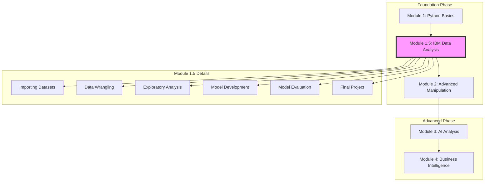

# Learning Progress Dashboard

## Learning Path

## Current Status
Foundation Phase: [##--------] 20%
Advanced Phase: Not Started

## Active Module: 1.5 - IBM Data Analysis with Python
- Course Link: [Data Analysis with Python](https://www.coursera.org/learn/data-analysis-with-python)
- Current Topic: Importing Datasets
- Progress: 0/6 Modules Complete
- Next Milestone: Complete Module 1 - Importing Datasets

## Module Completion Status

### ✅ Module 1: Python Basics
- [x] Python fundamentals
- [x] Basic data structures
- [x] Control structures
- [x] Functions and modules

### 🔄 Module 1.5: IBM Data Analysis
- [ ] Module 1: Importing Datasets
  * Understanding data types
  * Reading various file formats
  * Basic data exploration
- [ ] Module 2: Data Wrangling
  * Handling missing values
  * Data formatting
  * Data normalization
- [ ] Module 3: Exploratory Data Analysis
  * Descriptive statistics
  * Data visualization
  * Correlation analysis
- [ ] Module 4: Model Development
  * Linear regression
  * Model evaluation
  * Polynomial regression
- [ ] Module 5: Model Evaluation
  * Over/underfitting
  * Ridge regression
  * Grid search
- [ ] Module 6: Final Project
  * Applied data analysis
  * Real-world dataset
  * Complete analysis pipeline

### ⏳ Module 2: Advanced Manipulation
Status: Not Started

### ⏳ Module 3: AI Analysis
Status: Not Started

### ⏳ Module 4: Business Intelligence
Status: Not Started

## Recent Activity
- [2025-02-14] Initial progress tracking setup
- [2025-02-14] Completed Module 1: Python Basics
- [2025-02-14] Started IBM Data Analysis Course

## Next Steps
1. Complete Module 1 of IBM course (Importing Datasets)
   - Watch all video lectures
   - Complete hands-on exercises
   - Take module quiz
2. Practice with sample datasets
3. Prepare questions for next review meeting

## Resources
- IBM Course Materials
- Python basics notebook
- Sample datasets for practice
- Course discussion forums

## Notes
- Learning Pace: [X] hours per week
- Target completion for Module 1.5: [Date]
- Review sessions scheduled: [Frequency]
